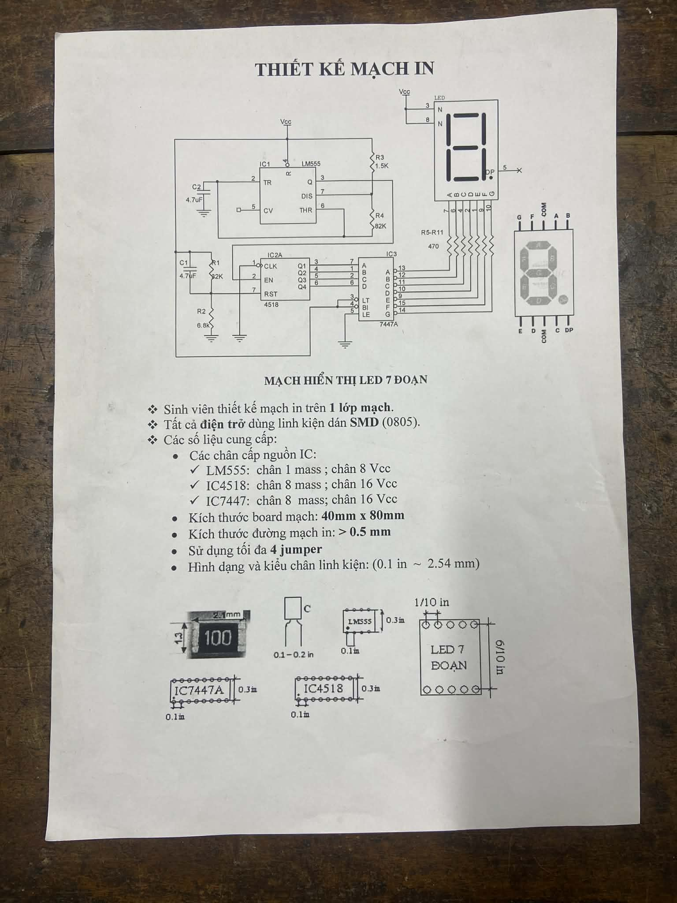

# 📦 Project Thực tập Điện tử 2 (Project-Dien-Tu-2)

> **Trường Đại học Bách Khoa - ĐHQG-HCM (Ho Chi Minh University of Technology)**
>
> Khoa Điện - Điện tử
>
> Môn học: Thực tập Điện tử 2 (EE3021)

## 📝 Giới thiệu chung
Dự án này được phát triển trong khuôn khổ môn học Thực tập Điện tử 2. Đây là Project cuối cùng của môn học, ngoài các mã nguồn thiết kế dưới đây, bạn cần thi công mạch in và hàn các phần cứng vào mạch để được ghi nhận quá trình và ghi nhận điểm Final cho học phần này.

## Đề bài

<p align="center">
  
  <br>
</p>


## 🛠 Phần cứng có trong mạch
* **IC tích hợp:**
  * LM555 (1)
  * 4518 (1)
  * 7447A (1)
* **Phần tử có trong mạch:**
  * Điện trở 470 (7)
  * Điện trở 32k (1)
  * Điện trở 1.5k (1)
  * Điện trở 6.8k (1)
  * Điện trở 82k (1)
  * Điện trở 32k (1)
  * Tự điện 4.7uF (2)
  * Led 7 Đoạn Commom Cathode (1)
* **Nguồn cấp:** Nguồn 5VDC từ máy cấp nguồn
* **Phần mềm thiết kế mạch:** Altium Designer / OrCAD Family / Proteus.

## ⚡ Sơ đồ nguyên lý của mạch dựng trên Orcad Capture CIS

<p align="center">
  
  <br>
</p>


## 📂 Cấu trúc Thư mục

```text
📦 main
 ┣ 📂 Image              # Thư viện hình ảnh
 ┣ 📂 Orcad         # File thiết kế trong phần mềm Orcad Family 9.2
 ┣ 📂 PCB PDF        # File PDF đường mạch đã xuất ra từ phần mềm
 ┣ 📂 Proteus           # File thiết kế trong phần mềm Proteus
 ┣ 📜 Topic.jpg       # File đề bài của thầy giao
 ┗ 📜 README.md         # Tài liệu tổng quan dự án
```
## 👥 Thành viên thực hiện
STT | Họ và tên | MSSV | Vai trò
--- | ---------- | ----- | ---------- |
1 | Vũ Nhật Huy |	2311267 | Thiết kế PCB bằng Altium Designer
2 | Nguyễn Minh Thuận |	2313355 | Thiết kế PCB bằng Orcad Family 9.2 và Proteus


Giảng viên hướng dẫn: ThS. Nguyễn Phạm Minh Luân - Bộ môn Điện tử.


---
**Tài liệu tải lên bởi Tom Nguyen nhằm mục đích lưu trữ, mọi hành vi sử dụng ngoài mục đich tham khảo đều là trái phép.**
